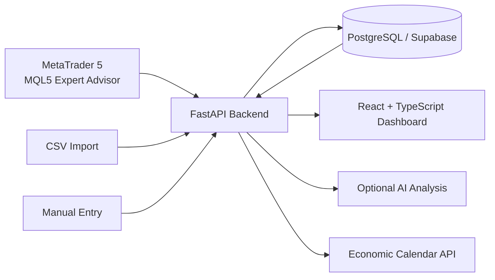

# Trading Journal

A personal full-stack trading analytics project built around my own trading workflow.

I wanted a better way to understand my performance than a broker statement or a spreadsheet could provide, so I built a journal that automatically imports MetaTrader 5 trades, centralizes trade data, and turns it into useful performance and risk analytics.

> This is a personal portfolio project. It is not a broker, execution system, investment recommendation engine, or institutional trading platform.

## Why I Built It

Broker statements are useful for recording executions, but they are not designed to answer the questions I care about as a trader:

- Which instruments generate the best results?
- Which trading sessions suit me best?
- What are my win rate, expectancy and profit factor?
- How large are my drawdowns?
- How does my realized R:R evolve?
- Are there recurring behavioural or timing patterns in my trades?

The project started as a practical tool for my own use and gradually became a complete full-stack application connecting trading data, analytics and software engineering.

## What It Does

- Automatic MetaTrader 5 trade ingestion through a custom MQL5 Expert Advisor
- Manual trade entry
- CSV import
- Centralized trade history and search
- Win rate, average win and average loss
- Profit factor and expectancy
- Realized R:R analysis
- Equity curve and maximum drawdown
- Performance by instrument
- Performance by trading session
- Calendar and time-based heatmap analysis
- Winning and losing streak analysis
- Trade notes, tags and psychology tracking
- Trading rules, checklist and playbook features
- Economic calendar integration
- Optional AI-assisted performance analysis
- Progressive Web App support for mobile use

## Architecture



The MetaTrader integration uses a dedicated account API key for ingestion. The raw key is returned when the account is created, while the backend stores and verifies its hash rather than storing the raw credential.

## Tech Stack

| Layer | Technologies |
|---|---|
| Frontend | React 18, TypeScript, Vite, TailwindCSS |
| Backend | Python, FastAPI |
| Database | PostgreSQL via Supabase |
| Authentication | Supabase Auth |
| Trading Integration | MetaTrader 5, MQL5 |
| Infrastructure | Docker, Vercel, Render |
| External Data | Finnhub economic calendar |
| Optional AI | Anthropic API |

## Selected Analytics

### Win Rate
Percentage of closed trades that finished with a positive net P&L.

### Profit Factor
Gross profits divided by gross losses, used to assess how much profit is generated for each unit of loss.

### Expectancy
Average expected P&L per trade based on observed win rate, average winner and average loser.

### Realized R:R
Tracks realized reward relative to the trade's defined risk when stop-loss information is available.

### Maximum Drawdown
Measures the largest percentage decline from an equity-curve peak to a subsequent trough.

### Performance Breakdown
Results can be reviewed by symbol, trading session, calendar date and time-of-day heatmaps to identify recurring patterns.

## MetaTrader 5 Integration

A custom MQL5 Expert Advisor sends trade information to the FastAPI backend.

The backend validates the account API key, associates the trade with the correct account, enriches closed trades with derived analytics, and stores the result in PostgreSQL.

The ingestion layer also prevents arbitrary client fields from being written directly by using an explicit allowlist of accepted trade fields.

## Optional AI Analysis

The project includes an optional AI-assisted analysis feature that summarizes recent trading performance and looks for patterns across instruments and sessions.

When this feature is used, selected trading data may be sent to an external AI provider for analysis. The AI output is intended as an analytical aid, not as investment advice or an automated trading decision.

## Running Locally

Clone the repository and follow the detailed setup guide:

```bash
git clone https://github.com/wxlly00/trading-journal.git
cd trading-journal
```

See [`SETUP.md`](SETUP.md) for the full local configuration, Supabase and Docker instructions.

The frontend can also be deployed separately from the FastAPI backend depending on the chosen infrastructure.

## Project Scope

This project was built primarily for my own trading workflow and as a way to combine finance with software development.

It is intentionally a journal and analytics application rather than:

- a brokerage platform;
- an order-execution engine;
- a signal-selling service;
- a profitability guarantee;
- institutional trading infrastructure.

The project focuses on collecting trading data, measuring performance and making post-trade review easier.

## What I Learned

Building this project required working across the complete application stack:

- translating a real finance workflow into software requirements;
- designing REST APIs with FastAPI;
- structuring user-specific data in PostgreSQL;
- integrating Supabase authentication and storage;
- connecting MetaTrader 5 to a web application through MQL5;
- calculating trading performance and risk metrics;
- handling data import, validation and duplicate prevention;
- deploying frontend and backend services;
- integrating external market-data and AI services.

The main value of the project for me was not just building another dashboard, but creating software around a workflow I actually use.

## Author

**Wilfried LAWSON HELLU**

Finance × Data × Software

GitHub: [github.com/wxlly00](https://github.com/wxlly00)
